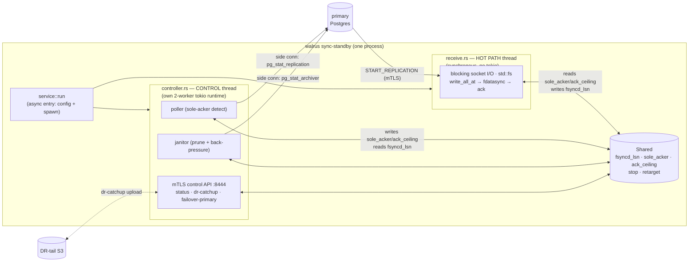

# `sync_replica` — the durable synchronous-standby receiver

`sync_replica` is a self-contained service (`walrus sync-standby <dir>`) that streams
WAL from a Postgres primary as a **durable synchronous standby**: it fsyncs WAL to local
disk and acks the flushed LSN, joining the primary's `synchronous_standby_names = ANY 1`
quorum alongside the streaming standby. It is the receiver half of Ubicloud `sync_pair` HA.

## Two threads, one bridge

The **hot path** (`receive.rs`) is deliberately tokio-free: one OS thread doing blocking
socket reads + positioned `write_all_at` + `fdatasync`, so a sole-acker commit pays no
task-scheduler latency. The **controller** (`controller.rs`) runs everything else — the
sole-acker poller, the retention janitor, and the mTLS control API — on its own tokio
runtime. They communicate only through `Shared` (lock-free atomics + a `Notify`).

## The documents

| Doc | What it explains |
|---|---|
| [state-machine.md](state-machine.md) | The receive-loop states (connect → stream → timeline-switch → reconnect/retarget/shutdown) and the sole-acker mode machine |
| [wal-record-lifecycle.md](wal-record-lifecycle.md) | Life of a WAL record: primary commit → frame → write → fsync → ack → quorum |
| [wal-segment-lifecycle.md](wal-segment-lifecycle.md) | Life of a WAL segment file: `.partial` → rotate/retain → prune or dr-catchup |
| [side-channel-queries.md](side-channel-queries.md) | The non-replication SQL the receiver runs, and why replication mode forbids it |

## Key modules
- `service.rs` — the `sync-standby` entry: resolve config, spawn the controller + the hot path.
- `receive.rs` — the synchronous receive hot path (`SyncSegmentWriter`, `run`, `run_session`).
- `controller.rs` — the control-plane runtime: `PeerLiveness` (sole-acker), janitor, back-pressure.
- `api.rs` — the mTLS control API (`GET /v1/status`, `POST /v1/dr-catchup`, `POST /v1/failover-primary`).
- `dr_tail.rs` — DR-tail S3 delivery of the retained WAL tail on failover.
- `shared.rs` — the cross-thread bridge (`Shared`).
