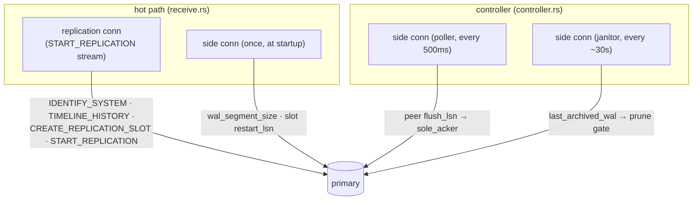

# Side-channel queries

A connection opened in **replication mode** (`replication=true` in the startup packet) can
only run replication commands (`IDENTIFY_SYSTEM`, `START_REPLICATION`, `TIMELINE_HISTORY`,
`CREATE_REPLICATION_SLOT`, …) — it **cannot** run ordinary SQL like `SELECT … FROM
pg_settings`. So whenever the receiver needs a normal query, it opens a separate
**non-replication side connection** (`ReplicationConn::connect_with(cfg, replication=false)`).
This mirrors wal-g's `getCurrentWalInfo`.



## The queries

| # | Query | Connection | Where | Cadence | Purpose |
|---|---|---|---|---|---|
| 1 | `SELECT setting FROM pg_settings WHERE name='wal_segment_size'` | side (non-repl) | `service.rs` → `conn::query_wal_segment_size` | once at startup | segment size (PG≤10 reports 8 KiB blocks, PG11+ bytes) drives all LSN↔segment math |
| 2 | `SELECT active, restart_lsn FROM pg_replication_slots WHERE slot_name=$1` | side (non-repl) | `receive.rs` → `query_slot_info` (in `connect_and_derive`) | per (re)connect | resolve the resume LSN; re-checked each connect because a failover target may hold a different slot state |
| 3 | `SELECT max(flush_lsn) FROM pg_stat_replication WHERE application_name<>$self AND state='streaming' AND sync_state IN ('sync','quorum','potential')` | side (non-repl) | `controller.rs` → `query_primary` | every `POLL_INTERVAL` (500 ms) | the peer sync standby's durable LSN → feeds `PeerLiveness` → `sole_acker` |
| 4 | `SELECT last_archived_wal FROM pg_stat_archiver` | side (non-repl) | `controller.rs` → `last_archived_wal` | every `JANITOR_INTERVAL` (~30 s) | how far the primary has archived → the janitor's prune gate |

Replication-protocol commands (on the streaming connection, not "side" queries) — listed for
completeness: `IDENTIFY_SYSTEM` (system id + current timeline/LSN), `CREATE_REPLICATION_SLOT
… PHYSICAL` (ensure the slot), `TIMELINE_HISTORY <tli>` (fetch + retain the `.history` on a
switch), `START_REPLICATION SLOT … PHYSICAL <lsn> TIMELINE <tli>` (begin the CopyBoth stream).

## Privilege gotcha — `pg_read_all_stats`

Query #3 is the one to watch. `pg_stat_replication`'s detail columns — `state`, `sync_state`,
and **`flush_lsn`** — read as **NULL for a non-superuser without `pg_read_all_stats`**. The
receiver connects as the replication role (`ubi_replication`), which is *not* a superuser.

If that role lacks `pg_read_all_stats`, query #3 returns NULL, the poller sees **no peer**,
`PeerLiveness` pins `sole_acker = true` forever, and the 2-acker batch window **never
engages** (the receiver silently does per-frame fsync in all modes — correct but ~4× the
IOPS). The fix is a one-time grant on the primary:

```sql
GRANT pg_read_all_stats TO ubi_replication;
```

In Ubicloud this is done in `rhizome/postgres/bin/post-installation-script` (new clusters) and
re-applied by the wal-receiver nexus `create_slot` step (existing clusters), so the poller can
see the peer's `flush_lsn` and drive the sole-acker decision. Query #4 (`pg_stat_archiver`) is
also a stats view and needs the same grant.
