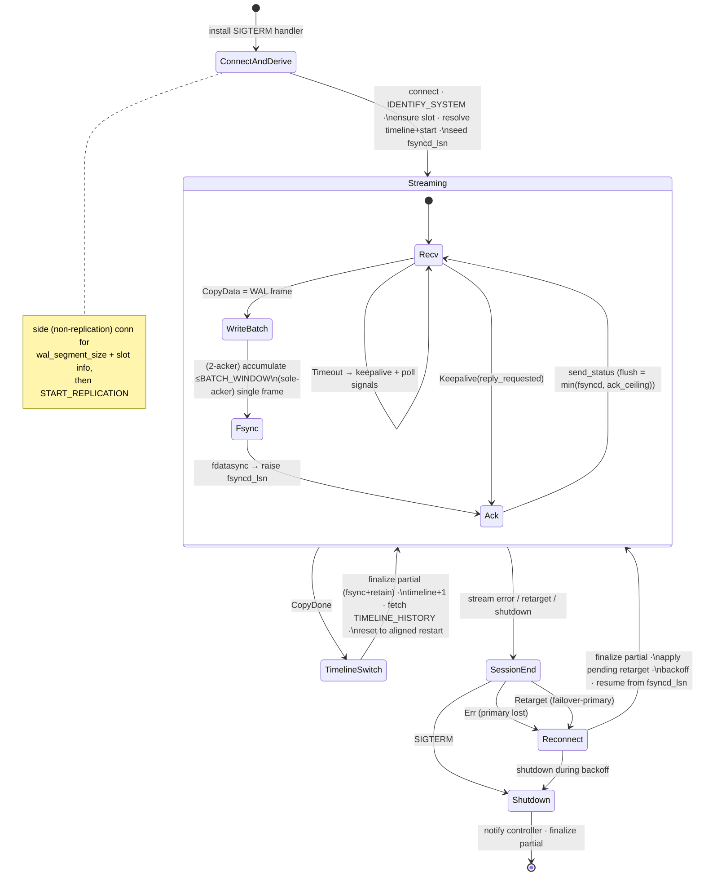
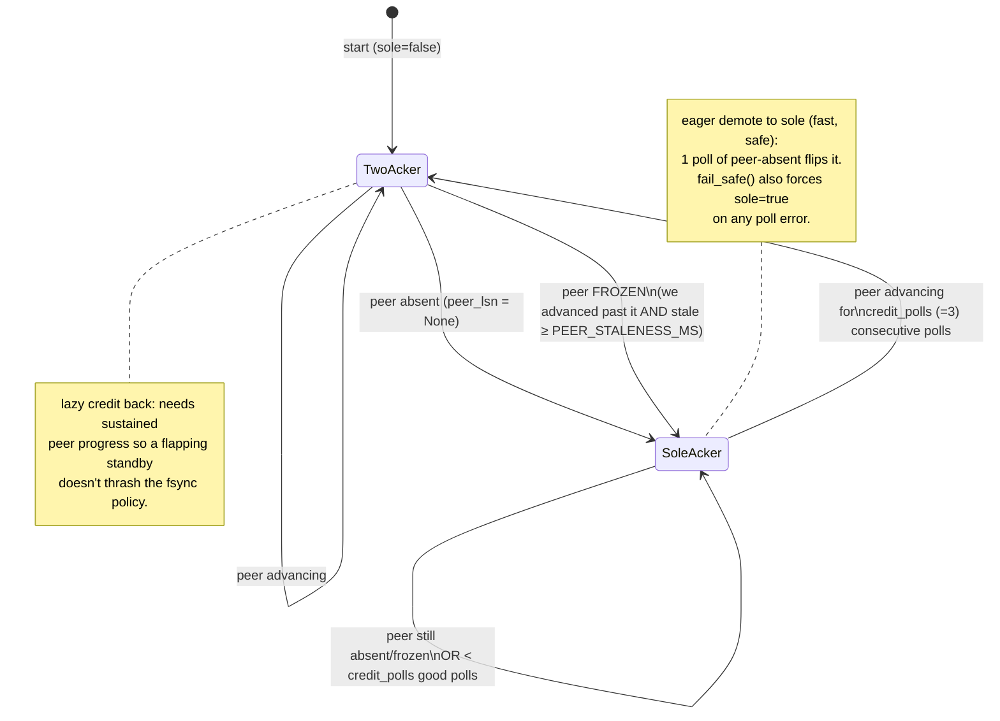

# The `sync_replica` state machines

Two state machines run concurrently and interact only through `Shared`:
1. the **receive hot path** (`receive.rs`) — connect, stream, switch timelines, reconnect;
2. the **sole-acker detector** (`controller.rs` `PeerLiveness`) — decides per-frame-fsync vs batch.

---

## 1. Receive hot path (`receive.rs::run` / `run_session`)



**Notes**
- **The reconnect loop never exits the process on a stream break.** A primary loss (or a
  `failover-primary` re-target) ends the *session*, not the process — so the controller's
  control API stays up and the CP can still drive dr-catchup / re-target. The receiver
  finalizes its partial (so the tail is fsync'd + retained for dr-catchup) and reconnects,
  resuming from `fsyncd_lsn` on the (possibly new) primary.
- **Durability invariant:** `fsyncd_lsn` is raised — and the flush ack sent — only *after*
  `fdatasync` returns for the bytes that LSN covers. `finalize_partial` also raises it (the
  deferred batch is durable on disk after the break), so failover recovery sees everything held.
- **Signals** (shutdown, retarget) are polled on the recv **timeout** tick, so a continuously
  busy stream is interrupted by the socket read timeout (`STATUS_UPDATE_INTERVAL`).

---

## 2. Sole-acker mode (`controller.rs::PeerLiveness`, drives `Shared.sole_acker`)

The poller queries the primary every `POLL_INTERVAL` (500 ms) for the peer sync standby's
`flush_lsn` and feeds it to `PeerLiveness::observe`. The verdict gates the hot path's fsync
policy: **`sole_acker = true` → per-frame fsync+ack** (this receiver is the only durable
acker, every commit blocks on it); **`false` → batch window** (the standby is the pacing
acker, so we coalesce ≤1 ms of frames per fsync to cut IOPS).



**Why asymmetric?** Demotion to sole-acker is *eager* (one absent poll, ≤500 ms) because
being wrong-optimistic risks under-fsyncing when we're actually the only acker. Promotion
back to 2-acker is *lazy* (3 sustained good polls) to avoid thrashing on a flapping peer.
On any poll/connection error the poller `fail_safe()`s to `sole_acker = true` — the safe side.

> The poller reads `pg_stat_replication.flush_lsn`, which is **NULL for a non-privileged
> role**. The receiver connects as `ubi_replication`, so the primary must grant it
> `pg_read_all_stats` — otherwise the peer is never seen, `sole_acker` sticks `true`, and the
> batch window never engages. See [side-channel-queries.md](side-channel-queries.md).

---

## 3. Back-pressure (janitor → `Shared.ack_ceiling`)

Independent of sole/2-acker: the janitor caps how far the reported flush LSN may advance so
retained WAL can't grow unbounded when the primary can't recycle it.

```mermaid
stateDiagram-v2
    [*] --> Open: ack_ceiling = u64::MAX
    Open --> Pinned: retained > budget\n(pin ceiling at current frontier)
    Pinned --> Pinned: retained still ≥ release low-water
    Pinned --> Open: retained drained < release (¾ budget)
    note right of Pinned
      send_status reports
      flush = min(fsyncd_lsn, ack_ceiling)
      → primary stops recycling past the pin
      → commits block rather than lose WAL.
      Hard cap drops the oldest as the last resort.
    end note
```
