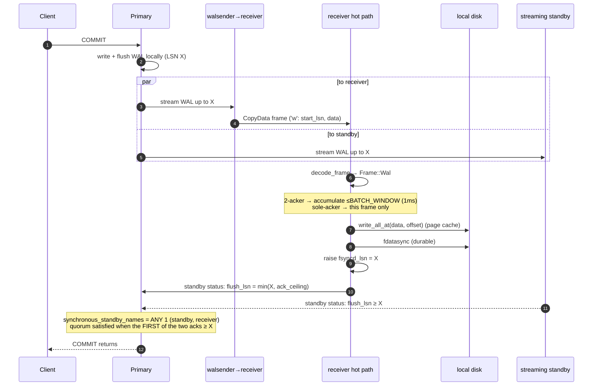

# Life of a WAL record

How a single committed WAL record travels from a client transaction on the primary,
through this receiver, and back as the flush ack that releases the commit.



## The critical ordering (never violated)

```
recv frame  →  write_all_at  →  fdatasync  →  raise fsyncd_lsn  →  send flush ack
                                   ▲                                     ▲
                        durable on disk FIRST                only report LSNs already fsync'd
```

The flush ack the primary counts toward the quorum is **never** ahead of `fdatasync`. That
is the whole promise: an acked LSN is on this receiver's disk. `send_status` reports
`flush = min(fsyncd_lsn, ack_ceiling)` — bounded below the durable frontier by back-pressure,
never above it.

## Two acking regimes (same ordering, different cadence)

| | `sole_acker = false` (2-acker) | `sole_acker = true` (sole-acker) |
|---|---|---|
| Who paces the commit | the streaming standby (usually faster) | **this receiver** — every commit blocks on our ack |
| fsync cadence | coalesce frames arriving within `BATCH_WINDOW` (≈1 ms) → one `fdatasync` for the batch | one `fdatasync` per frame, ack immediately |
| Why | our ack doesn't gate commits, so batching cuts IOPS ~4× at no latency cost | latency *is* throughput — no batching, ack the instant it's durable |

Because the receiver only receives frames it then fsyncs (and finalizes any deferred batch on
a stream break), the LSN it reports durable never lags what it physically holds — which is
what keeps **total-loss** recovery (both primary + standby gone) at RPO=0.

## Where a record can be lost (and why it isn't)
- **Between quorum-ack and this receiver having it:** with `ANY 1`, the *standby* can satisfy
  the quorum while our fsync is still in flight. If both primary and standby then vanish
  (total-loss), recovery relies on *our* frontier. The sole-acker per-frame fsync keeps that
  frontier current; the 2-acker batch window bounds the exposure to `BATCH_WINDOW`, and a
  stream break finalizes (fsyncs + reports) the in-flight batch before failover reads our LSN.
- **Receiver crash mid-batch:** un-fsync'd bytes are lost, but they were never acked as flushed
  — so no *acked* commit is lost (the primary/standby still hold them; the CP recovers from there).
