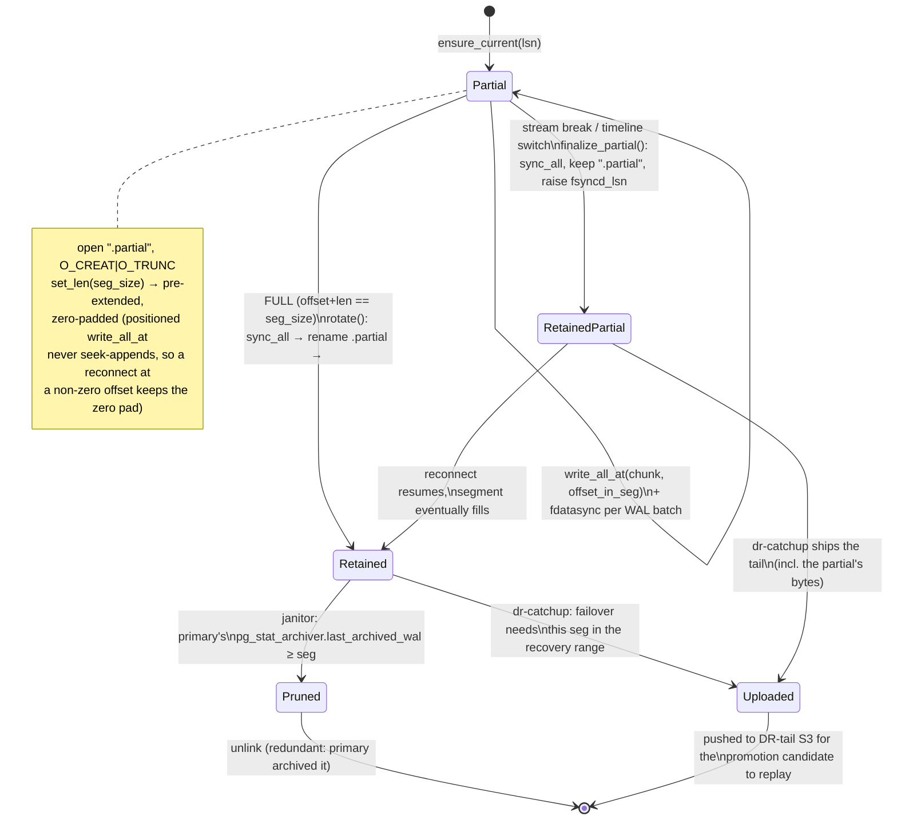

# Life of a WAL segment file

The receiver assembles WAL into fixed-size segment files (default 16 MiB) under the partial
dir, exactly like `pg_receivewal`: a segment is written as `<seg>.partial`, then atomically
renamed to the bare `<seg>` name once full — so a crash can never leave a torn partial
masquerading as a complete segment. `SyncSegmentWriter` (`receive.rs`) owns this.

## Stages

1. **`<seg>.partial` (open, being written).** `ensure_current` opens the file, `set_len`s it
   to the full segment size (pre-allocation + zero pad), and `write_all_at` places each WAL
   chunk at its absolute offset. `fdatasync` runs per WAL batch (see the record lifecycle),
   advancing `fsyncd_lsn`.
2. **Rotate → bare `<seg>` (retained).** When the write crosses the segment boundary,
   `rotate()` does `sync_all` (data + metadata durable) then `rename("<seg>.partial", "<seg>")`.
   Only complete segments ever carry the bare name. `sync_replica` **retains** them on disk
   (unlike the Uploader receiver, which ships each to object storage) — they are the durable
   WAL tail available for failover.
3. **Finalize on break → retained `.partial`.** A stream break or timeline switch calls
   `finalize_partial`: `sync_all` the in-progress file, keep it under `.partial`, and **raise
   `fsyncd_lsn`** to its durable end so the reported frontier reflects everything on disk
   (critical for total-loss RPO=0). It is not renamed — it isn't full — but its bytes are
   durable and dr-catchup-eligible.
4. **Terminal — one of:**
   - **Pruned** by the janitor once the primary's `pg_stat_archiver.last_archived_wal` shows
     the segment is safely in the archive (our copy is now redundant). Back-pressure
     (`ack_ceiling`) throttles the reported flush LSN if retention outgrows the budget before
     pruning can catch up; a hard cap drops the oldest as the last resort.
   - **Uploaded** to the DR-tail S3 lane by `dr_tail.rs` on `POST /v1/dr-catchup` during a
     failover, so a promotion candidate can fetch + replay the receiver-only tail
     (`[standby_lsn, receiver_lsn]`) it doesn't have from the base archive.

## Why the `.partial` / rename dance
`rename(2)` within a directory is atomic. Writing to `<seg>.partial` and only publishing the
bare `<seg>` after a full `sync_all` means: a crash mid-segment leaves a `.partial` (ignored
as incomplete), never a short bare `<seg>` that downstream tooling would trust as a finished,
replayable segment.
